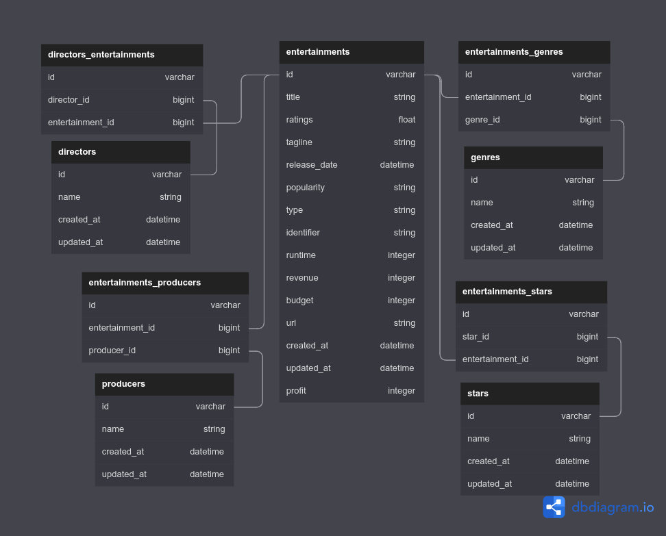

# Project: IMDb API

A Rails API extracting a Movie or Tv-Series data from the IMDb website via a link provided by the user which is then persisted to the database.

**This project was built on Rails version _7.0.4_ on top of Ruby version _3.1.2_.**

<div align="center">
  
</div>


<a href="https://wakatime.com/badge/user/ccef187f-4308-4666-920d-d0a9a07d713a/project/509003f7-2b71-4958-be09-1a0d27b03a0c"></a>

## ❗ Overview

- [x] Using PostgreSQL database to store the data.
- [x] Using the `Watir` & `Webdriver` gem to extract data from IMDb website.
- [x] User can create new entries in db by providing the correct URL.
- [x] Checks if the user input is a valid IMDb URL.
- [x] After validating URL, the process is passed to ActiveJob.
- [x] Checks if the content of a URL is a Movie or TV-Series.
- [x] Checks if the content has support to rate the show.
- [x] If all checks pass then the data extraction process begins and saves it to the database.
- [x] Existing data can also be updated via `update` action.
- [x] Users can also instantly instantiate data to the database via `seeds.rb` file.
- [ ] Provide business logic.

---

## Schema

<div align="center">
  
</div>

|  **Attribute**   |                                       **Desc**                                        |
| :--------------: | :-----------------------------------------------------------------------------------: |
|    **title**     |                            Title of the movie or TV-Series                            |
|    **rating**    |                            Ratings of the respective show                             |
|   **tagline**    |                             A short overview of the show                              |
| **release_date** |                               Release date of the show                                |
|  **popularity**  |                     Number of IMDb users who have rated the show                      |
|     **type**     |      An STI attribute, a show can either be an instance of a `Movie` or `TvShow`      |
|  **identifier**  | An unique IMDb id that starts with `tt` followed by exactly 7 digits found in the URL |
|   **runtime**    |                               Total runtime of a show.                                |
|   **revenue**    |                               Total revenue of the show                               |
|    **budget**    |                               Total budget of the show                                |
|     **url**      |                                    URL of the show                                    |

```
has_and_belongs_to_many :genres
has_and_belongs_to_many :stars
has_and_belongs_to_many :producers
has_and_belongs_to_many :directors
```

---

## 📋 Execution

Run the following commands to execute locally:

The following will install required version of ruby (make sure [rvm is installed](https://rvm.io/rvm/install).)

```bash
git clone git@github.com:JuzerShakir/imdb_api.git

gem install rails -v 7.0.4

cd imdb_api

bundle install
```

To successfully create development and test database, you will need to update `config.database.yml` file with correct postgresql username and password.
To edit the it without exposing your credentials, give the following command:

```bash
EDITOR="code --wait" rails credentials:edit
```

_`code` for Visual Studio Code_
_`subl` for sublime_

This will open `credential.yml` file and enter credential as follows in it:

```
database:
  username: your_username
  password: your_password
```

Hit `ctrl + s` to save and then close the `credential.yml` file from the editor. This will save the credentials. To check if it did save, run the following inside rails console:

```
Rails.application.credentials.dig(:database, :username)
```

Create database:

```bash
rails db:create
```

### Setting Up Sidekiq

[Video Tutorial](https://youtu.be/aaGSh38nzq8)

### Setting Up Redis

[Blog Tutorial](https://www.digitalocean.com/community/tutorials/how-to-install-and-secure-redis-on-ubuntu-18-04)

After setting up all this, you're ready to use this webapp.

---

## Feed Data

### Manually

Make sure first you instantiate rails server and sidekiq:

```bash
rails server
sidekiq
```

Create a POST request that will create a new instance in Entertainment table and others with HABTM relationship:

```bash
curl --request POST --header "Content-Type: application/json" --data '{"url": "https://www.imdb.com/title/tt0944947/"}' http://localhost:3000/api/entertainment -v
```

Update an existing entry of Movie or Tv-Series instance with:

```bash
curl --request PATCH --header "Content-Type: application/json" --data '{"identifier": "tt0306414"}' http://localhost:3000/api/entertainment -v
```

Which updates following attributes: `ratings`, `popularity`, `budget`, `revenue`

---

### Via Seed

The links are provided in the `lib/seed_data` folder which contains 2 files, `movie_links.txt` & `tv-series_links.txt`, where each file contains links of Top 250 [Movies](https://www.imdb.com/chart/top/?ref_=nv_mv_250) and [TV-Series](https://www.imdb.com/chart/toptv/?ref_=nv_tvv_250) according to IMDb ratings.

You can feed the database with 500 shows with a single `rails db:seed` command.

**Few things to note before running `rails db:seed`**

1. Depending on your system specifications, this process might heat up your system or even hang if you have other heavy programs running simultaneously.

2. It will first destroy all the instances from all the tables, if it exists, and then populate the data. If you wish to skip this process then do note that you might run into an **error** while seeding the data only **if any shows mentioned in those 2 files were already entered manually by you**.

3. The process of fetching a link, extracting the data and persisting to it to the database takes around ~5 secs. Calculating this time for all 500 shows would take around ~2500 secs (~42 mins).

4. The `seeds.rb` file doesn't execute all links one after the other. It has been divided into batches where each batch consists of 30 links. After executing each batch, the execution pauses for 30 seconds to avoid 'Are you a robot' check from the browser. So, the total time to execute all 500 shows will be ~50 mins.

5. If you don't want to initialize all 250 shows from each file then I have provided a constant named `N` in `seeds.rb` file which you can change to however many shows you want to populate in your database. **By default, I have set its value to `60` which means total shows executed will be 120, 60 from each file, which would take around 10 mins to execute.**

---
