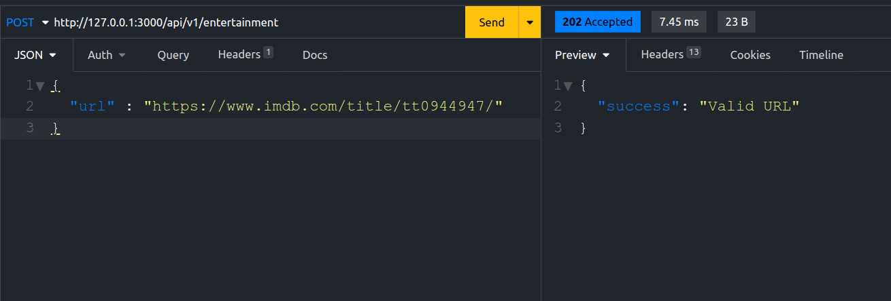
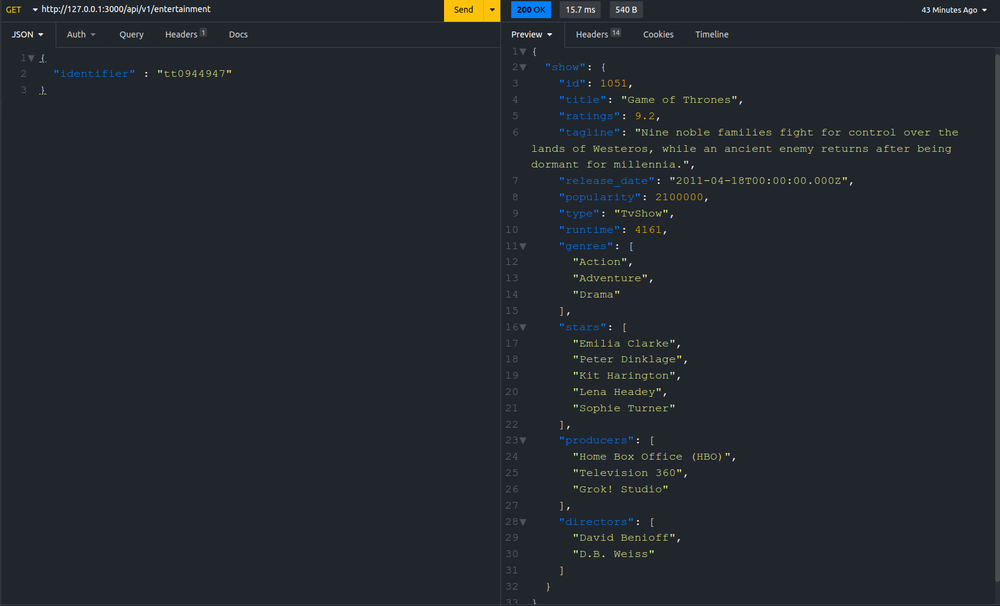
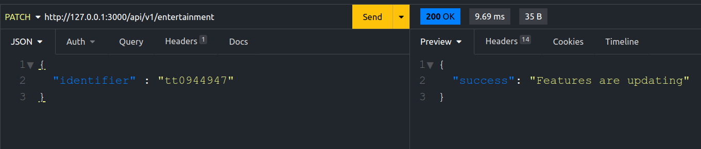
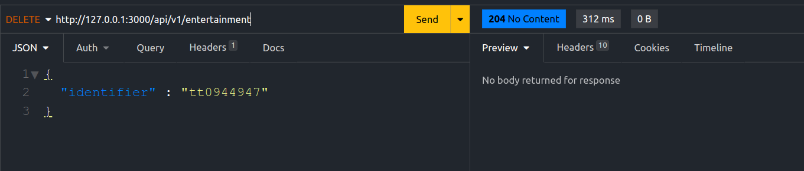

<div align="center">
  
  <h2>IMDb API</h2>
  <p>A Rails API for extracting data of a Movie or Tv-Series via an IMDb link provided by the user.</p>
</div>

<div align="center">

  

  

  

  
</div>

<div align="center">
  
  <a href="https://wakatime.com/badge/user/ccef187f-4308-4666-920d-d0a9a07d713a/project/509003f7-2b71-4958-be09-1a0d27b03a0c"></a>
</div>

<br>

<div align="center">
  <a href="https://www.buymeacoffee.com/juzershakir"> </a>
</div>

---

## Table of Contents

- [Summary](#summary)
- [Running the App](#running-the-app)
  - [Setup env for the app](#setup-env-for-the-app)
  - [Setup PostgreSQL](#setup-postgresql)
  - [Setup Background Jobs](#setup-background-jobs)
    - [Setting Up Sidekiq](#setting-up-sidekiq)
    - [Setting Up Redis](#setting-up-redis)
- [Feeding the Data](#feeding-the-data)
  - [Manually](#manually)
    - [POST request](#post-request)
    - [GET request](#get-request)
    - [PATCH request](#patch-request)
    - [DELETE request](#delete-request)
  - [Via Seed](#via-seed)

---

## Summary

- [x] Using PostgreSQL database to store the data.
- [x] Using the `Watir` & `Webdriver` gem to extract data from IMDb website.
- [x] User can create new entries in db by providing the correct URL.
- [x] Checks if the user input is a valid IMDb URL.
- [x] After validating URL, the process is passed to ActiveJob.
- [x] Checks if the content of a URL is a Movie or TV-Series.
- [x] Checks if the content can be rated by the users.
- [x] If all checks pass then the data extraction process begins.
- [x] Able to interact with data via other CRUD actions.
- [x] Users can also instantly instantiate data to the database via `rails db:seed` command.
- [x] Provide business logic.

To get a detailed information about the schema and relationships between models, check out this [wiki](https://github.com/JuzerShakir/imdb_api/wiki).

---

## Running the App

### Setup env for the app

Run the following commands to execute locally:

The following will install required version of ruby (make sure [rvm is installed](https://rvm.io/rvm/install).)

```bash
git clone git@github.com:JuzerShakir/imdb_api.git

gem install rails -v 7.0.4

cd imdb_api

bundle install
```

### Setup PostgreSQL

To successfully create development and test database, you will need to update `config.database.yml` file with correct postgresql username and password.
To edit the it without exposing your credentials, give the following command:

```bash
EDITOR="code --wait" rails credentials:edit
```

_`code` for Visual Studio Code_
_`subl` for sublime_

This will open `credential.yml` file and enter credential as follows in it:

```
database:
  username: your_username
  password: your_password
```

Hit `ctrl + s` to save and then close the `credential.yml` file from the editor. This will save the credentials. To check if it did save, run the following inside rails console:

```
Rails.application.credentials.dig(:database, :username)
```

Create and setup the database:

```bash
rails db:create db:migrate
```

### Setup Background Jobs

You will also need to install and setup sidekiq and redis to enable background jobs for extracting and saving data from IMDb website to db.

#### Setting Up Sidekiq

[Video Tutorial](https://youtu.be/aaGSh38nzq8)

#### Setting Up Redis

[Blog Tutorial](https://www.digitalocean.com/community/tutorials/how-to-install-and-secure-redis-on-ubuntu-18-04)

You're now ready to use this webapp.

---

## Feeding the Data

### Manually

Make sure first you instantiate rails server and sidekiq:

```bash
rails server
sidekiq
```

#### POST request

Performing a POST request by entering the correct URL of a Movie or TV-Series from IMDb website:

```bash
curl --request POST --header "Content-Type: application/json" --data '{"url": "https://www.imdb.com/title/tt0944947/"}' http://localhost:3000/api/v1/entertainment -v
```

Or with [insomnia](https://insomnia.rest/)



#### GET request

Performing a GET request with a valid IMDb ID which returns a JSON object of a Movie or Tv-Series:

```bash
curl --request GET --header "Content-Type: application/json" --data '{"identifier":"tt0944947"}' http://localhost:3000/api/v1/entertainment
```

Or with [insomnia](https://insomnia.rest/)



#### PATCH request

Performing a PATCH request to update an existing entry:

```bash
curl --request PATCH --header "Content-Type: application/json" --data '{"identifier": "tt0944947"}' http://localhost:3000/api/v1/entertainment -v
```

Or with [insomnia](https://insomnia.rest/)



Which will update the following attributes: `ratings`, `popularity`, `budget`, `revenue`

#### DELETE request

Performing a DELETE request to delete an existing entry:

```bash
curl --request DELETE --header "Content-Type: application/json" --data '{"identifier": "tt0944947"}' http://localhost:3000/api/v1/entertainment -v
```

Or with [insomnia](https://insomnia.rest/)



> > **NOTE**:
> > An IMDb ID can be found in the link of the URL which is followed by the 'title' text in the link, for example: _`https://www.imdb.com/title/tt5052448`_, here **tt5052448** is a Unique IMDb ID for that Movie or TV-Series which I call an `identifier` in my project.

---

### Via Seed

The `lib/seeds` folder contains 2 files, `movie_links.txt` & `tv-series_links.txt`, where each file contains links of Top 250 [Movies](https://www.imdb.com/chart/top/?ref_=nv_mv_250) and [TV-Series](https://www.imdb.com/chart/toptv/?ref_=nv_tvv_250) according to IMDb ratings respectively.

**Few things to note before running `rails db:seed`**

1. Depending on your system specifications, this process might take lots resources or even hang if you have other heavy programs running simultaneously. It is recommended that all programs should be closed.

2. The process of fetching a link, extracting the data and persisting to it to the database takes around ~7 secs. Calculating this time for all 500 shows would take around ~3500 secs (~1 hour).

3. The `seeds.rb` file doesn't execute all links one after the other. It has been divided into batches where each batch consists of 30 links. After executing each batch, the execution pauses for 30 seconds to avoid 'Are you a robot' check from the browser. So, the total time to execute all 500 shows will be ~66 mins.

4. I have provided a constant named `N` in `seeds.rb` file which you can change to however many shows you want to populate in your database. **By default, I have set its value to `125` which means total shows executed will be 250, 125 from each file, which would take around ~33 mins to execute.**

---

You can check out what scopes or class methods are available and their descriptions in this [wiki](https://github.com/JuzerShakir/imdb_api/wiki/Simple-Queries-with-Scopes). And you can also find some of the advanced queries given in SQL in this [wiki](https://github.com/JuzerShakir/imdb_api/wiki/Advanced-Queries-with-SQL).
